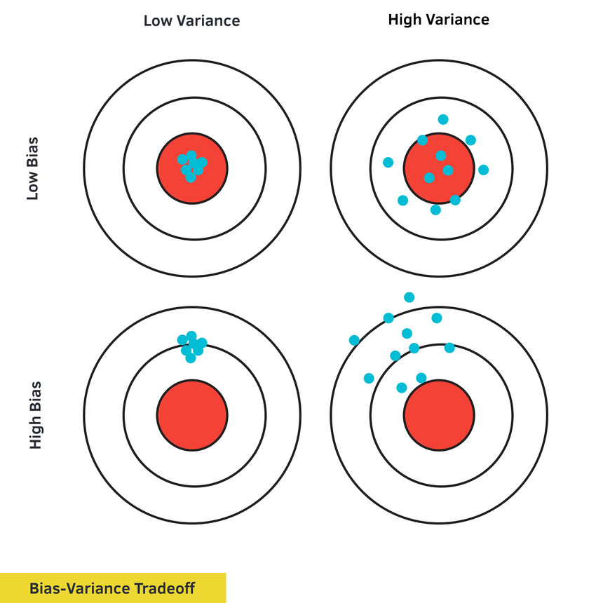

# Error on testing data

## Source

* bias  
* variance

## Explanation

Variable $x$ has mean $\mu$ and variance $\sigma^2$.

Estimator of mean

$$
\begin{aligned}
&m=\frac{1}{N}\sum_n^Nx^n\neq\mu
\\
&E[m]=E[\frac{1}{N}\sum_n^Nx^n]=\frac{1}{N}\sum_n^NE[x^n]=\mu
\end{aligned}
$$

Thus unbiased.

Estimator of variance

$$
\begin{aligned}
&s^2=\frac{1}{N}\sum_n^N(x^n-m)^2
\\
&E[s^2]=\frac{N-1}{N}\sigma^2
\end{aligned}
$$

Thus biased.

That means normally estimator of mean $m$ should be close to $\mu$, estimator of variance $s^2$ should be smaller than $\sigma^2$.

Simpler model is less influenced by the sampled data.

For bias, that means underfitting. We can redesign model, like

* more features  
* more complex model

For variance, that means overfitting. We can do something, like

* more data  
* regularization

